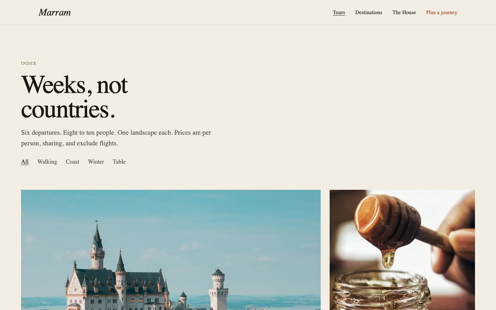

# Formgrid examples

Complete websites that use Formgrid as a form backend. Each example is a real marketing site, not a dashboard demo. A visitor should see a brand. A developer can later point the same form at a live Formgrid endpoint.

| Example | Preview | Source |
|---------|---------|--------|
| [Marram](#marram) | [Live site](https://allenarduino.github.io/formgrid/) | [`travel-agency/`](./travel-agency) |

## Marram

Small-group weeks in one landscape. Walking, rail, and the table. A fictional Lisbon travel house whose inquiry form is shaped for Formgrid.

[Preview the site](https://allenarduino.github.io/formgrid/) · [How to run it](./travel-agency)





From the repository root:

```bash
pnpm install
pnpm example:travel
```

Open [http://localhost:5174](http://localhost:5174).

### GitHub Pages

The travel example is a static Next.js export. After you push `main`, GitHub Actions builds `examples/travel-agency` and publishes it to Pages.

One-time setup in the GitHub repo:

1. Settings → Pages
2. Source: GitHub Actions

The live URL is [https://allenarduino.github.io/formgrid/](https://allenarduino.github.io/formgrid/). You can also run the workflow by hand from the Actions tab.

To send inquiries for real on the preview, set `NEXT_PUBLIC_FORMGRID_ENDPOINT` as a GitHub Actions variable (a public Formgrid form URL). Without it, the form still works and returns a local reference id.
