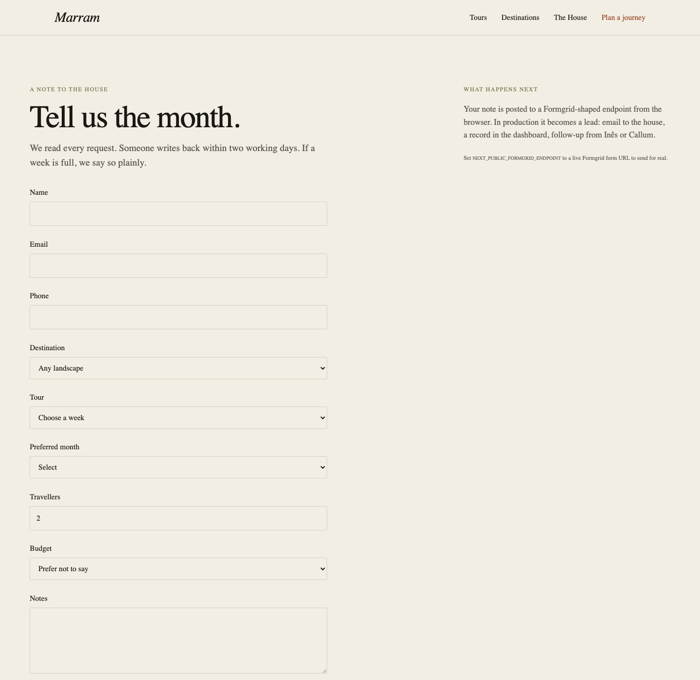

# Marram: Formgrid example

A fictional premium travel house used to show what a Formgrid-backed website can feel like when the infrastructure stays out of the way.

This is not a dashboard demo. It is a complete marketing site: destinations, tours, a house story, and an inquiry form. A visitor should see a travel company. A developer can later point the same form at a Formgrid endpoint.

[Live preview](https://allenarduino.github.io/formgrid/) · [Examples index](../)



## The brand

**Marram** plans small-group weeks in one landscape: walking, rail, and the table. Founded in Lisbon in 2014 (fictionally) by Inês Vale and Callum Reed. Groups of eight to ten. A printed field booklet goes out two weeks before departure.

## Run it

From the repository root (after `pnpm install`):

```bash
pnpm example:travel
```

Or from this folder:

```bash
pnpm install
pnpm dev
```

Open [http://localhost:5174](http://localhost:5174). The Formgrid dashboard does not need to be running.

```bash
pnpm build
pnpm start
```

`pnpm build` writes a static site to `out/`. `pnpm start` serves that folder.

## What it demonstrates

- Destinations (places, editorial) vs tours (bookable weeks)
- A realistic inquiry flow: visitor → `/plan` → `submitInquiry()` → Formgrid-shaped submission
- Typed domain data (`Destination`, `Tour`, `ItineraryDay`, `Testimonial`, `Inquiry`)
- Presentation code that never imports mock data directly
- App Router metadata, sitemap, robots, and JSON-LD on tour pages
- Static export, so the same site can run locally or on GitHub Pages

## Data layer

```
src/data/types.ts            Domain types
src/data/mock-data.ts        Destinations, tours, quotes, house copy
src/lib/formgrid/queries.ts  Read API used by pages
src/lib/formgrid/client.ts   submitInquiry()
```

Pages call `getDestinations()`, `getTours()`, `getTour(slug)`, and so on. The inquiry form calls `submitInquiry` in the browser. Swap that client to a live Formgrid POST without rewriting UI.

### Connect Formgrid later

1. Create a form in Formgrid.
2. Set the public endpoint (this value is inlined at build time):

```bash
NEXT_PUBLIC_FORMGRID_ENDPOINT=https://your-instance/api/f/marram-plan
```

3. `submitInquiry` already POSTs `{ formData: inquiry }` when that variable is set.

Optional: `NEXT_PUBLIC_SITE_URL` for canonical URLs and the sitemap (defaults to `http://localhost:5174`).

Without the endpoint, the form waits 700ms and returns a local reference id. Nothing is stored on a server.

## GitHub Pages

A workflow at `.github/workflows/deploy-travel-example.yml` builds this example and deploys `out/` to GitHub Pages.

1. In the GitHub repo: Settings → Pages → Source: GitHub Actions
2. Push to `main` (or run the workflow from the Actions tab)

The preview is [https://allenarduino.github.io/formgrid/](https://allenarduino.github.io/formgrid/). The workflow sets `NEXT_PUBLIC_BASE_PATH=/formgrid` so assets resolve under that project URL.

## Stack

Next.js 14 App Router, React 18, TypeScript. CSS variables in `src/styles/tokens.css`. No Tailwind, so the example does not inherit dashboard chrome.

## Pages

| Path | Page |
|------|------|
| `/` | Home |
| `/tours` | Index of weeks |
| `/tours/:slug` | Tour detail |
| `/destinations` | Landscapes |
| `/destinations/:slug` | Destination essay and weeks there |
| `/about` | The House |
| `/plan` | Inquiry form (`?tour=` preselects a week) |
| `/contact` | Studio |

## Photographs

Images are curated Unsplash URLs with photographer credits in captions. Replace with licensed originals in `public/images/` when this is more than an example.
